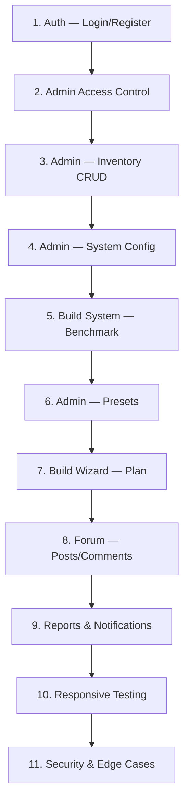

# 📋 PC Builder — Comprehensive Test Plan
> เอกสาร Test Plan สำหรับโปรเจกต์ PC Builder  
> จัดทำขึ้นเพื่อครอบคลุมการทดสอบทุกฟีเจอร์ก่อนนำเสนอต่ออาจารย์ที่ปรึกษา

---

## 🏗️ สถาปัตยกรรมที่ต้องทดสอบ

| Layer | Technology | ทดสอบอะไร |
|---|---|---|
| Frontend | Next.js 16 + React 19 + HeroUI | UI Rendering, Responsive, Interaction |
| Backend API | Next.js Route Handlers | CRUD, Validation, Error Handling |
| Database | PostgreSQL + Prisma ORM | Data Integrity, Relations |
| Auth | NextAuth.js (Credentials + Google) | Login, Register, Role-Based Access |
| File Upload | Cloudinary | Image Upload/Display |
| Middleware | next-auth/middleware | Route Protection |

---

## 📊 สรุป Test Cases ทั้งหมด

| หมวดหมู่ | จำนวน Test Cases | ความสำคัญ |
|---|---|---|
| 1. Authentication & User Management | 18 | 🔴 Critical |
| 2. PC Build System (Build Page) | 15 | 🔴 Critical |
| 3. Build Wizard (Plan Page) | 10 | 🟡 High |
| 4. Forum System | 16 | 🟡 High |
| 5. Admin Dashboard | 8 | 🟡 High |
| 6. Admin — Hardware Inventory | 12 | 🔴 Critical |
| 7. Admin — Preset Management | 10 | 🟡 High |
| 8. Admin — User Management | 8 | 🟡 High |
| 9. Admin — Reports System | 8 | 🟢 Medium |
| 10. Admin — System Config | 12 | 🔴 Critical |
| 11. Notification System | 6 | 🟢 Medium |
| 12. Homepage & Component Guide | 8 | 🟢 Medium |
| 13. Responsive & Cross-Browser | 6 | 🟡 High |
| 14. Security & Edge Cases | 10 | 🔴 Critical |
| **รวมทั้งหมด** | **147** | |

---

## 1. 🔐 Authentication & User Management

### 1.1 Registration (สมัครสมาชิก)
| ID | Test Case | Expected Result | Priority |
|---|---|---|---|
| AUTH-01 | สมัครด้วย Email + Password ที่ถูกต้อง | สมัครสำเร็จ User ถูกสร้างใน DB, role = "USER", status = "ACTIVE" | 🔴 Critical |
| AUTH-02 | สมัครด้วย Email ซ้ำ | แสดง Error "Email already exists" | 🔴 Critical |
| AUTH-03 | สมัครด้วย Username ซ้ำ | แสดง Error "Username already taken" | 🔴 Critical |
| AUTH-04 | สมัครโดยไม่กรอก Field ที่จำเป็น | แสดง Validation Error ที่ช่องนั้นๆ | 🟡 High |
| AUTH-05 | สมัครด้วย Password สั้นเกินไป | แสดง Error ความยาวไม่เพียงพอ | 🟡 High |

### 1.2 Login (เข้าสู่ระบบ)
| ID | Test Case | Expected Result | Priority |
|---|---|---|---|
| AUTH-06 | Login ด้วย Email + Password ถูกต้อง | Login สำเร็จ, redirect ไปหน้าแรก, Navbar แสดงชื่อ User | 🔴 Critical |
| AUTH-07 | Login ด้วย Password ผิด | แสดง Error "Invalid credentials" | 🔴 Critical |
| AUTH-08 | Login ด้วย Email ที่ไม่มีอยู่ | แสดง Error ไม่พบผู้ใช้ | 🔴 Critical |
| AUTH-09 | Login ด้วย Google OAuth | Login สำเร็จ, ข้อมูลจาก Google ถูกบันทึก | 🟡 High |
| AUTH-10 | Logout | Session ถูกลบ, redirect ไปหน้าแรก, Navbar กลับเป็น Guest | 🔴 Critical |

### 1.3 Password Management
| ID | Test Case | Expected Result | Priority |
|---|---|---|---|
| AUTH-11 | Forgot Password — ส่ง Email ที่มีอยู่จริง | ส่ง Email reset link สำเร็จ, สร้าง Token ใน DB | 🟡 High |
| AUTH-12 | Forgot Password — ส่ง Email ที่ไม่มี | แสดงข้อความเหมือนส่งสำเร็จ (ป้องกัน enumeration) | 🟡 High |
| AUTH-13 | Reset Password ด้วย Token ที่ถูกต้อง | เปลี่ยน Password สำเร็จ, Token ถูกใช้แล้วลบออก | 🟡 High |
| AUTH-14 | Reset Password ด้วย Token หมดอายุ | แสดง Error "Token expired" | 🟡 High |
| AUTH-15 | Change Password (ในหน้า Profile) | เปลี่ยน Password สำเร็จเมื่อกรอก Old Password ถูก | 🟡 High |

### 1.4 Profile
| ID | Test Case | Expected Result | Priority |
|---|---|---|---|
| AUTH-16 | ดู Profile ตัวเอง | แสดงข้อมูล name, username, bio, image ถูกต้อง | 🟡 High |
| AUTH-17 | แก้ไข Profile (name, bio) | อัปเดตสำเร็จ, ข้อมูลใหม่แสดงทันที | 🟡 High |
| AUTH-18 | อัปโหลดรูปโปรไฟล์ | Upload ไป Cloudinary สำเร็จ, แสดงรูปใหม่ | 🟢 Medium |

---

## 2. 🖥️ PC Build System (หน้า Build)

### 2.1 การเลือกอุปกรณ์
| ID | Test Case | Expected Result | Priority |
|---|---|---|---|
| BUILD-01 | โหลดหน้า Build → แสดง 8 หมวดหมู่ | แสดง CPU, Mainboard, RAM, GPU, Storage, PSU, Cooler, Case | 🔴 Critical |
| BUILD-02 | คลิกเลือก CPU → แสดงรายการ CPU ทั้งหมดจาก DB | Modal เปิดแสดงรายการ CPU พร้อมราคา | 🔴 Critical |
| BUILD-03 | เลือก Component แล้ว → แสดงชื่อและราคาในช่อง | ชื่อรุ่น + ราคาปรากฏในช่องที่เลือก | 🔴 Critical |
| BUILD-04 | เปลี่ยน Component → คำนวณราคารวมใหม่ | Total Price อัปเดตอัตโนมัติ | 🔴 Critical |
| BUILD-05 | แสดง Detail อุปกรณ์ (Socket, DDR, FormFactor) | รายละเอียดแสดงถูกต้องตาม type ของ component | 🟡 High |

### 2.2 Benchmark & Scoring
| ID | Test Case | Expected Result | Priority |
|---|---|---|---|
| BUILD-06 | เลือก CPU + GPU → คำนวณ Gaming Score | % Gaming Score คำนวณจาก Baseline + Weights ถูกต้อง | 🔴 Critical |
| BUILD-07 | เลือก CPU + RAM + Storage → คำนวณ Working Score | % Working Score ถูกต้องตามสูตร | 🔴 Critical |
| BUILD-08 | เลือกครบ → คำนวณ Creative Score | % Creative Score ถูกต้องตามสูตร | 🔴 Critical |
| BUILD-09 | ไม่ได้เลือกบาง Component → Score แสดง N/A หรือ 0 | ไม่เกิด NaN หรือ Error | 🟡 High |
| BUILD-10 | Score > 100% (อุปกรณ์แรงเกิน Baseline) | แสดงเกิน 100% ได้ ระบบไม่ cap | 🟢 Medium |

### 2.3 บันทึก Build
| ID | Test Case | Expected Result | Priority |
|---|---|---|---|
| BUILD-11 | กด Save Build (ล็อกอินแล้ว) | บันทึกลง DB สำเร็จ, แสดง Toast "บันทึกสำเร็จ" | 🔴 Critical |
| BUILD-12 | กด Save Build (ยังไม่ล็อกอิน) | เด้ง Modal ให้ Login ก่อน | 🔴 Critical |
| BUILD-13 | บันทึกโดยไม่ได้ตั้งชื่อ Build | แสดง Error ให้กรอกชื่อ | 🟡 High |
| BUILD-14 | ดู Build ที่บันทึกไว้ใน Profile | แสดงรายการ Builds ของ User ถูกต้อง | 🟡 High |
| BUILD-15 | ลบ Build | ลบสำเร็จ, หายจากรายการ | 🟡 High |

---

## 3. 🧭 Build Wizard (หน้า Plan)

| ID | Test Case | Expected Result | Priority |
|---|---|---|---|
| PLAN-01 | กดปุ่ม "PLAN YOUR BUILD" จากหน้าแรก | Navigate ไปหน้า `/plan` | 🟡 High |
| PLAN-02 | Step 1 — แสดง 3 ตัวเลือก (Gaming/Working/Creative) | แสดงการ์ด 3 ใบ พร้อม Icon + คำอธิบาย | 🟡 High |
| PLAN-03 | เลือก Usage → ไปยัง Step 2 | Progress indicator เปลี่ยนเป็น Step 2, แสดง 4 ระดับงบ | 🟡 High |
| PLAN-04 | เลือก Budget → ไปยัง Step 3 | โหลด Preset จาก API และแสดงผลลัพธ์ | 🔴 Critical |
| PLAN-05 | ไม่มี Preset สำหรับ Usage+Budget ที่เลือก | แสดงข้อความ "ยังไม่มีสเปกแนะนำ" + ปุ่มทางเลือก | 🟡 High |
| PLAN-06 | มี Preset → แสดงรายการอุปกรณ์พร้อมเหตุผล | แสดงชื่อรุ่น, Icon, เหตุผล, ราคาแยกชิ้น, ราคารวม | 🔴 Critical |
| PLAN-07 | กดปุ่ม "ปรับแต่งสเปกนี้ต่อในหน้า Build" | Navigate ไป `/build` | 🟡 High |
| PLAN-08 | กดปุ่ม "ย้อนกลับ" ใน Step 2 | กลับไป Step 1 | 🟡 High |
| PLAN-09 | กดปุ่ม "เลือกงบใหม่" ใน Step 3 | กลับไป Step 2, ล้างผลลัพธ์เก่า | 🟡 High |
| PLAN-10 | กดปุ่ม "ข้ามไปจัดสเปกเอง" | Navigate ไป `/build` ทันที | 🟢 Medium |

---

## 4. 💬 Forum System

### 4.1 Posts (กระทู้)
| ID | Test Case | Expected Result | Priority |
|---|---|---|---|
| FORUM-01 | โหลดหน้า Forum → แสดงโพสต์ทั้งหมด | แสดงรายการโพสต์ public เรียงตามวันที่ล่าสุด | 🟡 High |
| FORUM-02 | สร้างโพสต์ใหม่ (มี title, content, category) | โพสต์ถูกบันทึก, แสดงในรายการทันที | 🔴 Critical |
| FORUM-03 | สร้างโพสต์พร้อมรูปภาพ | Upload รูปไป Cloudinary, แสดงในโพสต์ | 🟡 High |
| FORUM-04 | สร้างโพสต์ + แนบ PC Build | แสดง Build spec ในโพสต์ | 🟡 High |
| FORUM-05 | กดดูรายละเอียดโพสต์ | แสดงเนื้อหาครบ, รูป, comments, build | 🟡 High |
| FORUM-06 | แก้ไข Privacy (Public/Private) ของโพสต์ตัวเอง | เปลี่ยนสถานะสำเร็จ | 🟢 Medium |
| FORUM-07 | แสดง Forum Policies ในหน้า Forum | แสดงกฎระเบียบที่ Admin กำหนดไว้ | 🟢 Medium |

### 4.2 Comments & Interactions
| ID | Test Case | Expected Result | Priority |
|---|---|---|---|
| FORUM-08 | เขียน Comment ในโพสต์ | Comment ปรากฏใต้โพสต์ทันที | 🟡 High |
| FORUM-09 | กด Like โพสต์ | จำนวน Like เพิ่ม 1, ปุ่มเปลี่ยนสถานะ | 🟡 High |
| FORUM-10 | กด Unlike โพสต์ (กด Like ซ้ำ) | จำนวน Like ลด 1, ปุ่มกลับสถานะเดิม | 🟡 High |
| FORUM-11 | กด Like Comment | จำนวน Like ของ Comment เพิ่ม 1 | 🟢 Medium |

### 4.3 Report System
| ID | Test Case | Expected Result | Priority |
|---|---|---|---|
| FORUM-12 | Report โพสต์ (เลือก reason + กรอก description) | Report ถูกสร้างใน DB, reportCount ของ User เพิ่ม | 🟡 High |
| FORUM-13 | Report Comment | Report ถูกสร้างสำเร็จ | 🟡 High |
| FORUM-14 | Report User ที่มี reportCount >= 3 → severity = AUTO HIGH | severity ถูกตั้งเป็น HIGH อัตโนมัติ | 🟢 Medium |

### 4.4 การเข้าถึง
| ID | Test Case | Expected Result | Priority |
|---|---|---|---|
| FORUM-15 | Guest (ไม่ Login) ดูโพสต์ได้ | อ่านโพสต์ได้ แต่ไม่เห็นปุ่ม Comment/Like | 🟡 High |
| FORUM-16 | Guest กดเขียนโพสต์ | เด้งให้ Login | 🟡 High |

---

## 5. 📊 Admin — Dashboard

| ID | Test Case | Expected Result | Priority |
|---|---|---|---|
| ADMIN-01 | เข้าหน้า Admin ด้วย User ทั่วไป | Redirect กลับหน้าแรก (Middleware block) | 🔴 Critical |
| ADMIN-02 | เข้าหน้า Admin ด้วย ADMIN role | แสดง Dashboard + Sidebar | 🔴 Critical |
| ADMIN-03 | Dashboard แสดงสถิติ (Users, Components, Posts, Builds) | ตัวเลขตรงกับข้อมูลจริงใน DB | 🟡 High |
| ADMIN-04 | แสดงกราฟ Activity (Recent Posts Trend) | กราฟ Recharts render ถูกต้อง | 🟢 Medium |
| ADMIN-05 | แสดง Latest Reports | แสดงรายการ Report ล่าสุด | 🟢 Medium |
| ADMIN-06 | แสดง System Health | แสดงสถานะ Database, Storage | 🟢 Medium |
| ADMIN-07 | Sidebar Navigation ทำงานครบทุกลิงก์ | คลิกแต่ละเมนู Navigate ถูกต้อง + Highlight active | 🟡 High |
| ADMIN-08 | หน้า Admin ไม่แสดง Footer | Footer ถูกซ่อนด้วย `pathname.startsWith("/admin")` | 🟢 Medium |

---

## 6. 🖥️ Admin — Hardware Inventory

| ID | Test Case | Expected Result | Priority |
|---|---|---|---|
| INV-01 | แสดงรายการอุปกรณ์ทั้งหมด | แสดง Table พร้อม type, name, brand, price | 🟡 High |
| INV-02 | กรองตาม Type (CPU, GPU, RAM...) | แสดงเฉพาะอุปกรณ์ที่ตรง type | 🟡 High |
| INV-03 | เพิ่ม CPU ใหม่ — กรอก socket, cpuSingle, cpuMulti | บันทึกสำเร็จ, แสดงในรายการ | 🔴 Critical |
| INV-04 | เพิ่ม GPU ใหม่ — กรอก gpuScore, vramGb | บันทึกสำเร็จ | 🔴 Critical |
| INV-05 | เพิ่ม RAM ใหม่ — กรอก ramType, ramSpeed, capacity | บันทึกสำเร็จ | 🔴 Critical |
| INV-06 | เพิ่ม Mainboard — กรอก socket, ramType, formFactor | บันทึกสำเร็จ | 🔴 Critical |
| INV-07 | เพิ่ม Storage — กรอก readWriteSpeed, capacity | บันทึกสำเร็จ | 🟡 High |
| INV-08 | เพิ่ม PSU — กรอก capacity (watt) | บันทึกสำเร็จ | 🟡 High |
| INV-09 | เลือกหมวด CPU → Detail fields แสดง Socket/Score | ไม่แสดง DDR หรือ field ที่ไม่เกี่ยว | 🔴 Critical |
| INV-10 | แก้ไขอุปกรณ์ → อัปเดตข้อมูล | ข้อมูลอัปเดตถูกต้องใน DB | 🟡 High |
| INV-11 | ลบอุปกรณ์ | ลบสำเร็จ, หายจากรายการ | 🟡 High |
| INV-12 | เพิ่มอุปกรณ์โดยไม่กรอก Field ที่จำเป็น | แสดง Validation Error | 🟡 High |

---

## 7. 🚀 Admin — Preset Management

| ID | Test Case | Expected Result | Priority |
|---|---|---|---|
| PRESET-01 | แสดงรายการ Presets ทั้งหมด (Active + Inactive) | แสดง Preset cards ทั้งหมด | 🟡 High |
| PRESET-02 | สร้าง Preset ใหม่ — เลือก Usage, Budget, Component จาก DB | บันทึกสำเร็จ, hiển thị ในรายการ | 🔴 Critical |
| PRESET-03 | เลือก Component จาก Dropdown → Auto-fill ชื่อ + ราคา | ชื่อและราคาถูก Auto-fill | 🟡 High |
| PRESET-04 | ราคารวมคำนวณอัตโนมัติจากราคาอุปกรณ์ | Total Price = ผลรวมราคาทุกชิ้นที่กรอก | 🟡 High |
| PRESET-05 | แก้ไข Preset → อัปเดตข้อมูล | ข้อมูลอัปเดตถูกต้อง | 🟡 High |
| PRESET-06 | ลบ Preset | ลบสำเร็จ, หายจากรายการ | 🟡 High |
| PRESET-07 | Toggle Active/Inactive | สถานะเปลี่ยน, Preset ที่ inactive ไม่แสดงใน `/plan` | 🔴 Critical |
| PRESET-08 | สร้าง Preset โดยไม่กรอกชื่อ | แสดง Error "กรุณากรอกชื่อ Preset" | 🟡 High |
| PRESET-09 | สร้าง Preset โดยไม่เลือกอุปกรณ์เลย | แสดง Error "กรุณาเลือกอุปกรณ์อย่างน้อย 1 ชิ้น" | 🟡 High |
| PRESET-10 | ถ้า DB ไม่มี Component บางหมวด → Fallback เป็น Input | แสดง Input ให้พิมพ์ชื่อเองแทน Dropdown | 🟢 Medium |

---

## 8. 👥 Admin — User Management

| ID | Test Case | Expected Result | Priority |
|---|---|---|---|
| USER-01 | แสดงรายการ User ทั้งหมด | แสดง Table: name, email, role, status, reportCount | 🟡 High |
| USER-02 | แก้ไข Role (USER → ADMIN) | Role อัปเดตสำเร็จ | 🟡 High |
| USER-03 | แก้ไข Status (ACTIVE → SUSPENDED) | Status อัปเดตสำเร็จ | 🟡 High |
| USER-04 | แก้ไข Status (ACTIVE → BANNED) | Status = BANNED, User ไม่สามารถ Login ได้อีก | 🔴 Critical |
| USER-05 | ลบ User | User ถูกลบ, Cascade ลบ Posts/Comments/Builds ทั้งหมด | 🔴 Critical |
| USER-06 | ลบ User ที่เป็น ADMIN | ป้องกันการลบ ADMIN (ถ้ามี safeguard) หรือลบได้ | 🟡 High |
| USER-07 | Reset Report Count | reportCount กลับเป็น 0 | 🟢 Medium |
| USER-08 | ค้นหา User ด้วยชื่อ/Email | แสดงผลที่ตรงกัน | 🟢 Medium |

---

## 9. 📝 Admin — Reports System

| ID | Test Case | Expected Result | Priority |
|---|---|---|---|
| REPORT-01 | แสดง Reports ทั้งหมด | แสดงรายการ Report พร้อม type, reason, severity, status | 🟡 High |
| REPORT-02 | กรองตาม Status (PENDING/RESOLVED/IGNORED) | แสดงเฉพาะ Report ที่ตรง filter | 🟡 High |
| REPORT-03 | เปลี่ยนสถานะ Report → RESOLVED | Status อัปเดต + สร้าง Notification ให้ผู้ถูก Report | 🟡 High |
| REPORT-04 | เปลี่ยนสถานะ Report → IGNORED | Status อัปเดต | 🟢 Medium |
| REPORT-05 | คลิกลิงก์ targetUrl → ไปยังโพสต์ที่ถูก Report | Navigate ถูกต้อง | 🟢 Medium |
| REPORT-06 | Download Report (CSV/JSON) | ดาวน์โหลดไฟล์สำเร็จ, ข้อมูลครบถ้วน | 🟢 Medium |
| REPORT-07 | Report ที่ severity = URGENT แสดงสีแดง | Visual indicator แสดงถูกต้อง | 🟢 Medium |
| REPORT-08 | PENDING Report Count ในหน้า Dashboard ตรงกัน | จำนวนตรงกับ Reports ที่ status = PENDING | 🟢 Medium |

---

## 10. ⚙️ Admin — System Configuration

### 10.1 Performance Baselines
| ID | Test Case | Expected Result | Priority |
|---|---|---|---|
| CONFIG-01 | แสดง Baseline ปัจจุบัน (Gaming, Working, Creative) | แสดงค่าจาก DB ถูกต้อง | 🔴 Critical |
| CONFIG-02 | แก้ไข Baseline → กด Save → Confirmation Modal (ระดับ Critical) | แสดง Modal เตือนว่า "จะส่งผลต่อ Benchmark ทั้งระบบ" | 🔴 Critical |
| CONFIG-03 | ยืนยันบันทึก Baseline → ค่าอัปเดตใน DB | ค่า Baseline ใหม่ถูกบันทึกและใช้ในการคำนวณ Score | 🔴 Critical |
| CONFIG-04 | ยกเลิก → ค่าไม่เปลี่ยน | ค่า Baseline คงเดิม | 🟡 High |

### 10.2 Weighting Configuration
| ID | Test Case | Expected Result | Priority |
|---|---|---|---|
| CONFIG-05 | แสดงค่า Weights ปัจจุบัน (Gaming, Working, Creative) | แสดงค่าจาก DB ถูกต้อง | 🔴 Critical |
| CONFIG-06 | ปรับ Weights → รวมกัน = 100% → Badge สีเขียว ✅ | Badge แสดงถูกต้อง, ปุ่ม Save เปิดใช้งาน | 🔴 Critical |
| CONFIG-07 | ปรับ Weights → รวมกัน ≠ 100% → Badge สีแดง ❌ | Badge แสดงแดง, Input แดง, ปุ่ม Save ถูก Disable | 🔴 Critical |
| CONFIG-08 | Save Weights ที่ถูกต้อง → Confirmation Modal | แสดง Modal เตือนระดับ Critical | 🔴 Critical |

### 10.3 Categories & Forum Policies
| ID | Test Case | Expected Result | Priority |
|---|---|---|---|
| CONFIG-09 | แสดง Forum Categories ปัจจุบัน | แสดงรายการ Categories ถูกต้อง | 🟢 Medium |
| CONFIG-10 | แก้ไข Forum Categories → Simple Confirmation | แสดง Alert ถามยืนยัน (ไม่ใช่ Modal ระดับ Critical) | 🟡 High |
| CONFIG-11 | แก้ไข Forum Policies → บันทึกสำเร็จ | ค่าอัปเดตใน DB + แสดงในหน้า Forum | 🟡 High |
| CONFIG-12 | ตรวจสอบ Forum Policy แสดงในหน้า `/forum` | แสดง Policy ที่ Admin กำหนดไว้ | 🟡 High |

---

## 11. 🔔 Notification System

| ID | Test Case | Expected Result | Priority |
|---|---|---|---|
| NOTIF-01 | ผู้ใช้มี Notification ใหม่ → แสดง Badge บน Navbar | Badge สีแดงแสดงจำนวนที่ยังไม่อ่าน | 🟡 High |
| NOTIF-02 | คลิกดู Notification → Mark as Read | isRead = true, Badge อัปเดต | 🟡 High |
| NOTIF-03 | Notification มี Link → คลิกแล้ว Navigate ถูกต้อง | Navigate ไปยัง URL ที่กำหนด | 🟢 Medium |
| NOTIF-04 | Mark All as Read | Notification ทั้งหมด → isRead = true | 🟢 Medium |
| NOTIF-05 | Admin ทำ action กับ Report → ผู้ถูกReport ได้ Notification | Notification ถูกสร้าง type = "SYSTEM" | 🟢 Medium |
| NOTIF-06 | โหลดหน้าจอ → ดึง Notification ของ User | แสดงเฉพาะ Notification ของ User ที่ Login อยู่ | 🟡 High |

---

## 12. 🏠 Homepage & Component Guide

| ID | Test Case | Expected Result | Priority |
|---|---|---|---|
| HOME-01 | โหลดหน้าแรก → แสดง Hero Banner + 3D Animation | Banner render ถูกต้อง, Animation ทำงาน | 🟢 Medium |
| HOME-02 | ปุ่ม "PLAN YOUR BUILD" → Navigate ไป `/plan` | Navigate ถูกต้อง | 🟡 High |
| HOME-03 | Scroll Indicator (ลูกศรชี้ลง) → กดแล้ว Smooth Scroll | Scroll ลงไปที่ Build Sequence อย่าง Smooth | 🟢 Medium |
| HOME-04 | Build Sequence แสดง 8 ขั้นตอนครบ | แสดง CPU → Mainboard → RAM → ... → Case | 🟢 Medium |
| HOME-05 | PC Component Guide Slider → ลากซ้าย/ขวาได้ | Slider ลื่น, ไม่กระตุก | 🟡 High |
| HOME-06 | กด "See more" บน Component Card → เปิด Modal | Modal แสดง title, desc, details ครบ | 🟡 High |
| HOME-07 | Component Guide Slider → Touch Support (มือถือ) | ลากด้วยนิ้วได้ | 🟢 Medium |
| HOME-08 | Footer แสดงถูกต้อง (3 คอลัมน์) | Brand, เมนูหลัก, อ้างอิง PassMark | 🟢 Medium |

---

## 13. 📱 Responsive & Cross-Browser

| ID | Test Case | Expected Result | Priority |
|---|---|---|---|
| RESP-01 | หน้า Home — Mobile (375px) | Layout ปรับตัว, Banner resize, Slider กว้าง 95vw | 🟡 High |
| RESP-02 | หน้า Build — Mobile | สามารถเลือก Component + ดู Score ได้สะดวก | 🟡 High |
| RESP-03 | หน้า Forum — Mobile | โพสต์แสดงเต็มจอ, ปุ่มจัดวางถูกต้อง | 🟡 High |
| RESP-04 | หน้า Admin — Mobile | Sidebar เปลี่ยนเป็น Horizontal Nav, ใช้งานได้ | 🟡 High |
| RESP-05 | หน้า Plan (Build Wizard) — Mobile | การ์ดแสดง 1 คอลัมน์, ปุ่มย้อนกลับใช้งานได้ | 🟡 High |
| RESP-06 | Footer — Mobile | เรียงเป็น 1 คอลัมน์, ลิงก์กดได้ | 🟢 Medium |

---

## 14. 🔒 Security & Edge Cases

| ID | Test Case | Expected Result | Priority |
|---|---|---|---|
| SEC-01 | เข้า `/admin` โดยไม่ Login | Redirect ไปหน้า Login | 🔴 Critical |
| SEC-02 | เข้า `/admin` ด้วย Role = USER | Redirect ไปหน้าแรก | 🔴 Critical |
| SEC-03 | เรียก Admin API โดยตรง (ไม่ผ่าน UI) | ตรวจสอบ Authorization (ถ้ามี) | 🔴 Critical |
| SEC-04 | SQL Injection ผ่าน Form Input | Prisma ป้องกัน, ไม่เกิด SQL Injection | 🔴 Critical |
| SEC-05 | XSS — ใส่ `<script>` ใน ชื่อ Build / โพสต์ | ไม่ Execute script, แสดงเป็น plain text | 🔴 Critical |
| SEC-06 | อัปโหลดไฟล์ที่ไม่ใช่รูป | ระบบปฏิเสธ หรือ Cloudinary reject | 🟡 High |
| SEC-07 | ส่ง Request Body เปล่า / มี field ไม่ครบ | API ตอบ 400 Bad Request | 🟡 High |
| SEC-08 | Delete User ของตัวเอง (Admin ลบตัวเอง) | มี safeguard หรือทำงานถูกต้อง | 🟡 High |
| SEC-09 | Concurrent Save Build (กด Save 2 ครั้งติด) | ไม่เกิด Duplicate Entry | 🟡 High |
| SEC-10 | Password ไม่ถูก Hash ก่อนเก็บ DB? | ตรวจสอบว่า bcrypt hash ทำงานถูกต้อง | 🔴 Critical |

---

## 📌 ลำดับการทดสอบที่แนะนำ

> **เหตุผล:** เริ่มจาก Auth เพราะทุกฟีเจอร์ต้องพึ่ง Login → ต่อด้วย Admin เพราะต้องมีข้อมูลใน DB ก่อน → แล้วค่อยทดสอบ User-facing features

---

## 🏷️ Test Environment

| รายการ | ค่า |
|---|---|
| **Framework** | Next.js 16.1.6 (Turbopack) |
| **Database** | PostgreSQL 15 (Docker) |
| **Local URL** | `http://localhost:3000` |
| **Test Tool** | TestSprite (MCP) |
| **Browser** | Chrome (Primary), Firefox, Safari (Mobile) |
| **Viewports** | Desktop (1920px), Tablet (768px), Mobile (375px) |
